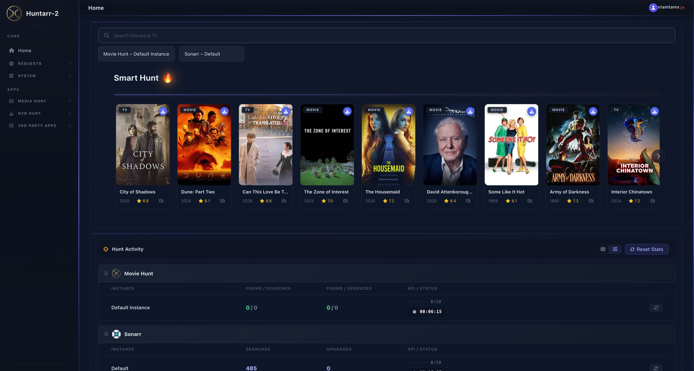
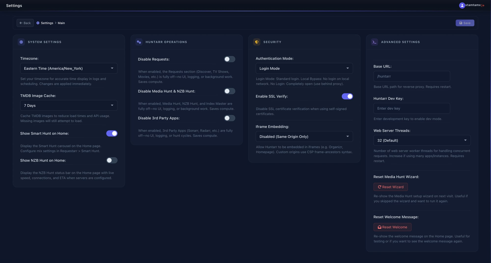

# Huntarr-2

A fork of Huntarr with security patches and customizations. I am not taking any credit here, just trying to help people use the thing still in a safe manner.

Feel free to fork yourself.

## What is Huntarr?

Huntarr is a media automation companion that supercharges your *arr stack. It works alongside Radarr, Sonarr, Lidarr, Readarr, and Whisparr to:

- 🎬 **Movie Hunt** — Automatically search for missing movies and upgrades
- 📺 **TV Hunt** — Find missing episodes and quality upgrades
- 🎵 **Music Hunt** — Keep your music library complete via Lidarr
- 📚 **Book Hunt** — Automate book searches with Readarr
- 📰 **NZB Hunt** — Built-in NZB downloader (no SABnzbd needed)
- 🔍 **Indexer Hunt** — Prowlarr integration for indexer management
- 🎯 **Requestarr** — User request system with TMDB integration
- 🔄 **Swaparr** — Stalled download management

## Features

- **Unified Dashboard** — Manage all your *arr apps from one interface
- **Smart Scheduling** — Configurable hunt cycles with hourly caps
- **Import Lists** — Automated media discovery from TMDB, Trakt, etc.
- **Backup & Restore** — Full configuration backup system
- **Notifications** — Discord, Telegram, email, and more
- **Multi-Instance** — Support for multiple Radarr/Sonarr instances
- **Dark Theme** — Modern, responsive UI

## Installation

### Docker (Recommended)

```yaml
version: '3.8'
services:
  huntarr:
    image: huntarr/huntarr:latest
    container_name: huntarr
    ports:
      - "9705:9705"
    volumes:
      - ./config:/config
    restart: unless-stopped
```

### Manual

```bash
git clone https://github.com/xtamtamx/huntarr-2.git
cd huntarr-2
pip install -r requirements.txt
python main.py
```

Access the web UI at `http://localhost:9705`

## Configuration

On first launch, Huntarr-2 runs a setup wizard to configure:

1. **Authentication** — Set admin username/password
2. **App Connections** — Connect your *arr instances (Radarr, Sonarr, etc.)
3. **Indexers** — Configure via Prowlarr or manually
4. **Scheduling** — Set hunt intervals and caps

All configuration is stored in the `/config` volume.

## What's Different in Huntarr-2?

This fork includes:
- Security patches (see `.security-backup/` for original files)
- Renamed branding to "Huntarr-2"
- Personal customizations

## Tech Stack

- **Backend:** Python/Flask
- **Frontend:** HTML/CSS/JavaScript (Jinja2 templates)
- **Database:** SQLite
- **Deployment:** Docker

## Screenshots

### Home Dashboard


### Settings


## Credits

Based on Huntarr by PlexGuide.

## License

MIT License
